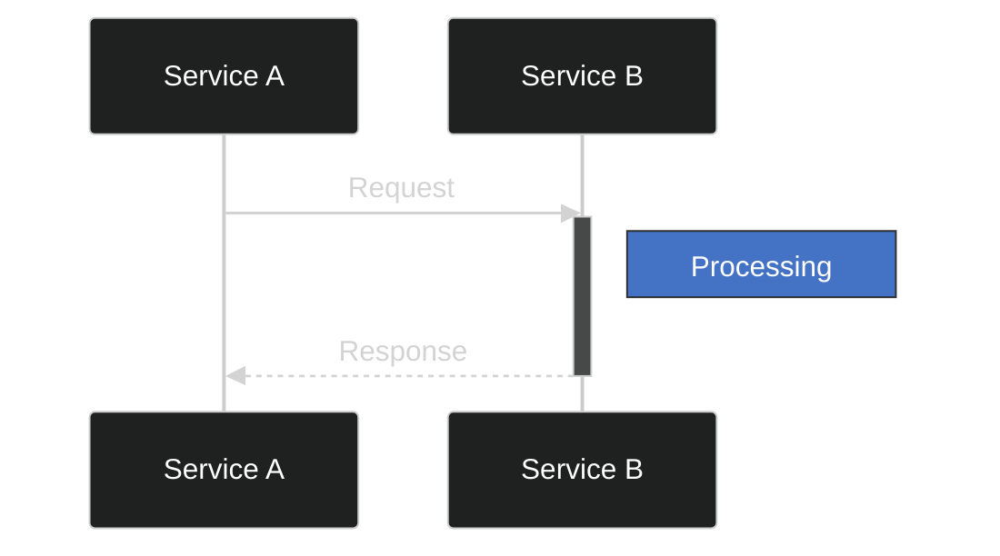
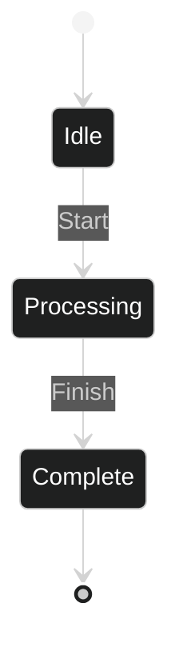
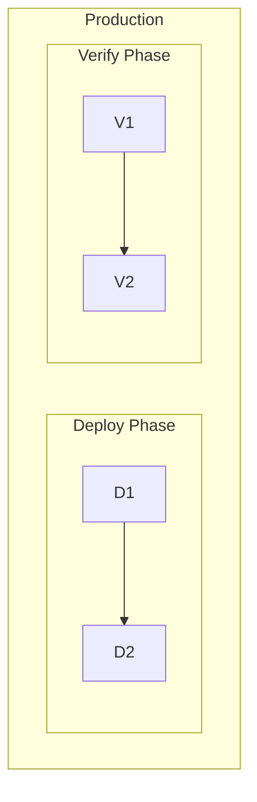

# Mermaid Diagram Builder

## Overview

Create professional, consistent Mermaid diagrams with validated styling, approved color schemes, and guaranteed rendering quality. This skill provides templates, validation tools, and comprehensive styling guidelines to ensure all Mermaid diagrams are visually consistent, highly readable, and render without errors.

## Core Capabilities

### 1. Diagram Creation with Approved Styling

When creating any Mermaid diagram, always:

1. **Choose appropriate theme** - Dark theme for technical docs, light theme for presentations/reports (see Color Theme Guide below)
2. **Use approved color palette** from `references/color_theme_guide.md`
3. **Define reusable classes** using `classDef` for consistent styling
4. **Validate** using the validation script before finalizing

### 2. Supported Diagram Types

All standard Mermaid diagram types are supported:

- **Flowcharts** (`flowchart TD` / `flowchart LR`) - Process flows, decision trees, workflows
- **Sequence Diagrams** (`sequenceDiagram`) - System interactions, API calls, message flows
- **State Diagrams** (`stateDiagram-v2`) - State machines, lifecycle diagrams
- **Class Diagrams** (`classDiagram`) - Object models, database schemas
- **Entity Relationship** (`erDiagram`) - Database relationships
- **Gantt Charts** (`gantt`) - Project timelines, schedules
- **Git Graphs** (`gitGraph`) - Git branching strategies
- **Pie Charts** (`pie`) - Data visualization
- **Mind Maps** (`mindmap`) - Concept mapping
- **Timelines** (`timeline`) - Historical events, roadmaps

### 3. Automatic Validation

After creating or modifying any Mermaid diagram, validate it using:

```bash
python scripts/validate_mermaid.py <file_path>
```

Or pipe diagram content:

```bash
echo "<mermaid_content>" | python scripts/validate_mermaid.py stdin
```

The validator checks for:
- Syntax correctness
- Approved color usage
- Text readability (length, contrast)
- Proper theme configuration
- Styling best practices

## Quick Start Guide

### Creating a New Flowchart

1. **Start with the appropriate template**:
   - Dark theme: `assets/template_flowchart.md`
   - Light theme: `assets/template_flowchart_light.md`

2. **Apply theme configuration and class definitions:**

**For dark theme:**

```mermaid
%%{init: {'theme':'dark', 'themeVariables': { 'primaryColor':'#1a1a1a', 'primaryTextColor':'#fff', 'primaryBorderColor':'#fff', 'lineColor':'#fff', 'secondaryColor':'#4472C4', 'tertiaryColor':'#1a1a1a'}}}%%

flowchart TD
    classDef statusNode fill:#4472C4,stroke:#fff,stroke-width:2px,color:#fff
    classDef productionNode fill:#FFA500,stroke:#fff,stroke-width:2px,color:#000
    classDef successNode fill:#4CAF50,stroke:#fff,stroke-width:2px,color:#fff
    classDef errorNode fill:#E74C3C,stroke:#fff,stroke-width:2px,color:#fff
    classDef defaultNode fill:#1a1a1a,stroke:#fff,stroke-width:2px,color:#fff
```

**For light theme:**

```mermaid
%%{init: {'theme':'default', 'themeVariables': { 'primaryColor':'#E8EAF6', 'primaryTextColor':'#000', 'primaryBorderColor':'#7986CB', 'lineColor':'#666', 'secondaryColor':'#C5E1A5', 'tertiaryColor':'#FFE082'}}}%%

flowchart TD
    classDef statusNode fill:#BBDEFB,stroke:#1976D2,stroke-width:2px,color:#000
    classDef actionNode fill:#E1BEE7,stroke:#7B1FA2,stroke-width:2px,color:#000
    classDef decisionNode fill:#FFF9C4,stroke:#F57C00,stroke-width:2px,color:#000
    classDef successNode fill:#C8E6C9,stroke:#388E3C,stroke-width:2px,color:#000
    classDef warningNode fill:#FFE0B2,stroke:#E65100,stroke-width:2px,color:#000
    classDef errorNode fill:#FFCDD2,stroke:#C62828,stroke-width:2px,color:#000
    classDef defaultNode fill:#F5F5F5,stroke:#616161,stroke-width:2px,color:#000
```

3. **Define nodes with semantic naming:**

```mermaid
    Start([Start Process]):::defaultNode
    Process[Processing Data]:::statusNode
    Decision{Valid?}:::defaultNode
    Deploy[Deploy to Production]:::productionNode
    Success([Success]):::successNode
    Error([Error]):::errorNode
```

4. **Connect nodes with arrows:**

```mermaid
    Start --> Process
    Process --> Decision
    Decision -->|Yes| Deploy
    Decision -->|No| Error
    Deploy --> Success
```

5. **Validate before finalizing:**

```bash
python scripts/validate_mermaid.py diagram.md
```

### Creating a Sequence Diagram

Use the template from `assets/template_sequence.md`:



### Creating a State Diagram

Use the template from `assets/template_state.md`:



## Color Theme Reference

### Theme Selection

Choose between dark and light themes based on use case:

- **Dark Theme**: Best for technical documentation, dark-mode interfaces, developer-focused content
- **Light Theme**: Best for presentations, reports, printable documents, or when a softer, more accessible appearance is needed

### Approved Color Palettes

**Dark Theme Colors:**
- Background: `#1a1a1a` (dark)
- Text: `#ffffff` (white)
- Accent Colors: Blue `#4472C4`, Orange `#FFA500`, Green `#4CAF50`, Red `#E74C3C`

**Light Theme Colors:**
- Background: Light pastels
- Text: `#000000` (black)
- Accent Colors: Light Blue `#BBDEFB`, Light Purple `#E1BEE7`, Light Yellow `#FFF9C4`, Light Green `#C8E6C9`, Light Orange `#FFE0B2`, Light Red `#FFCDD2`

For complete color specifications and usage guidelines, see `references/color_theme_guide.md`.

### Standard Class Definitions

**Dark Theme Classes:**

```mermaid
classDef statusNode fill:#4472C4,stroke:#fff,stroke-width:2px,color:#fff
classDef productionNode fill:#FFA500,stroke:#fff,stroke-width:2px,color:#000
classDef successNode fill:#4CAF50,stroke:#fff,stroke-width:2px,color:#fff
classDef errorNode fill:#E74C3C,stroke:#fff,stroke-width:2px,color:#fff
classDef defaultNode fill:#1a1a1a,stroke:#fff,stroke-width:2px,color:#fff
classDef neutralNode fill:#6c757d,stroke:#fff,stroke-width:2px,color:#fff
```

**Light Theme Classes:**

```mermaid
classDef statusNode fill:#BBDEFB,stroke:#1976D2,stroke-width:2px,color:#000
classDef actionNode fill:#E1BEE7,stroke:#7B1FA2,stroke-width:2px,color:#000
classDef decisionNode fill:#FFF9C4,stroke:#F57C00,stroke-width:2px,color:#000
classDef successNode fill:#C8E6C9,stroke:#388E3C,stroke-width:2px,color:#000
classDef warningNode fill:#FFE0B2,stroke:#E65100,stroke-width:2px,color:#000
classDef errorNode fill:#FFCDD2,stroke:#C62828,stroke-width:2px,color:#000
classDef defaultNode fill:#F5F5F5,stroke:#616161,stroke-width:2px,color:#000
```

**For complete color reference and usage guidelines**, see `references/color_theme_guide.md`.

## Best Practices

### Text Readability

1. **Keep node text concise** - Under 60 characters per line
2. **Use line breaks** for longer descriptions:
   ```mermaid
   A["First Line<br/>Second Line<br/>Third Line"]
   ```
3. **High contrast text** - White on dark, black on light backgrounds
4. **Bold important text**:
   ```mermaid
   B["<b>Important Title</b><br/>Supporting description"]
   ```

### Styling Consistency

1. **Always include dark theme init** at the top
2. **Use classDef** for repeated styling (don't inline styles multiple times)
3. **Apply semantic class names** (statusNode, errorNode, etc.)
4. **Maintain consistent arrow styles** within a diagram

### Diagram Organization

1. **Top-down flow** (`flowchart TD`) for process flows
2. **Left-right flow** (`flowchart LR`) for timelines
3. **Group related nodes** using subgraphs:
   ```mermaid
   subgraph Production
       A --> B --> C
   end
   ```
4. **Use descriptive node IDs** (not just A, B, C)

## Workflow: Creating Diagrams

### For Simple Diagrams (< 10 nodes)

1. Start with appropriate template from `assets/`
2. Modify nodes and connections
3. Apply approved colors using class definitions
4. Validate using `validate_mermaid.py`
5. Fix any errors or warnings
6. Embed in markdown file

### For Complex Diagrams (10+ nodes)

1. Sketch structure and identify node types
2. Start with template and theme configuration
3. Define all necessary class definitions
4. Build diagram section by section
5. Test rendering incrementally
6. Validate entire diagram
7. Refine based on validation feedback
8. Embed in markdown file

### For Existing Diagram Updates

1. Read existing diagram
2. Check current styling against approved palette
3. Apply missing theme configuration if needed
4. Update colors to match approved palette
5. Validate changes
6. Ensure backward compatibility if embedded

## Validation Checklist

Before finalizing any Mermaid diagram, ensure:

- [ ] Dark theme configuration included
- [ ] Uses only approved color palette
- [ ] Class definitions used for repeated styling
- [ ] Text is concise and readable (< 60 chars per line)
- [ ] High contrast between text and background
- [ ] Proper diagram type syntax
- [ ] All nodes have semantic class applications
- [ ] Validation script passes without errors
- [ ] Renders correctly in markdown preview

## Common Patterns

### Status-Based Workflow

```mermaid
Start[Pending]:::defaultNode
Process[In Progress]:::statusNode
Done[Completed]:::successNode
Failed[Error]:::errorNode

Start --> Process
Process --> Done
Process --> Failed
```

### Environment Progression

```mermaid
Dev[Development]:::statusNode
UAT[UAT Testing]:::statusNode
Prod[Production]:::productionNode

Dev --> UAT
UAT --> Prod
```

### Decision Trees

```mermaid
Question{Is Valid?}:::defaultNode
Question -->|Yes| Approve[Approved]:::successNode
Question -->|No| Reject[Rejected]:::errorNode
```

## Resources

### scripts/validate_mermaid.py
Python validation script that checks:
- Mermaid syntax correctness
- Color palette compliance
- Text readability standards
- Theme configuration presence
- Styling best practices

Execute after creating or modifying diagrams to ensure quality.

### references/color_theme_guide.md
Comprehensive color palette reference including:
- Complete approved color list with hex codes
- Usage guidelines for each color
- Contrast ratios and accessibility standards
- Diagram-type-specific recommendations
- Advanced styling patterns
- Complete working examples

Reference this file for detailed color guidance and advanced patterns.

### assets/
Template files for quick starts:
- `template_flowchart.md` - Complete flowchart example with all styling
- `template_sequence.md` - Sequence diagram example
- `template_state.md` - State diagram example

Copy templates as starting points for new diagrams.

## Troubleshooting

### Diagram Won't Render

1. Check syntax using validator
2. Ensure proper code fence: \`\`\`mermaid ... \`\`\`
3. Verify diagram type keyword (flowchart, sequenceDiagram, etc.)
4. Check for unclosed quotes or brackets
5. Validate arrow syntax (-->, ->>>, etc.)

### Colors Not Appearing

1. Verify theme init block is present
2. Check class definitions are included
3. Ensure nodes have `:::className` applied
4. Confirm hex codes are valid 6-character format
5. Check that Mermaid renderer supports custom styling

### Text Not Readable

1. Run validation script to check text length
2. Verify contrast ratio (white on dark, black on light)
3. Add line breaks for long text
4. Consider abbreviations or shorter phrasing
5. Use subgraphs to group and label sections

### Validation Warnings

- **Color not approved**: Switch to nearest approved color from palette
- **Text too long**: Add `<br/>` line breaks or simplify wording
- **Missing theme**: Add dark theme init block at top
- **No classDef**: Define classes instead of inline styling

## Advanced Techniques

### Nested Subgraphs



### Styling Edges

```mermaid
A -->|Normal| B
A -.->|Dotted| C
A ==>|Thick| D
A ---|Text on edge| E
```

### HTML Formatting in Nodes

```mermaid
Node1["<b>Bold Title</b><br/><i>Italic subtitle</i><br/>Regular text"]
```

### Dynamic Styling with Variables

Reference `color_theme_guide.md` for complete examples of theme variables and advanced customization.
