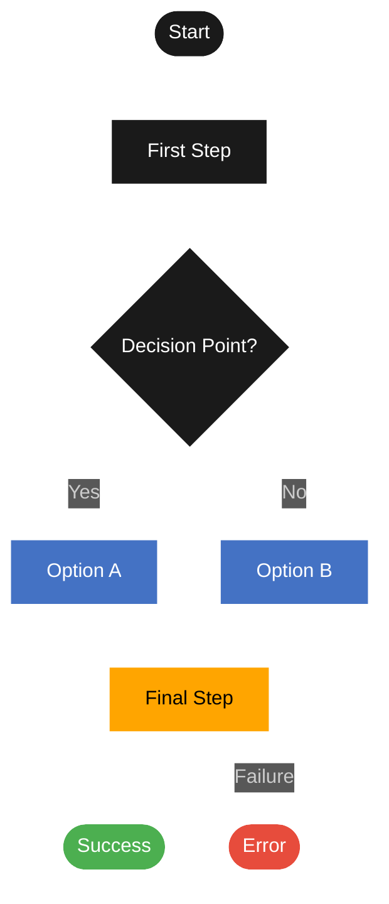

# Flowchart Template

```mermaid
%%{init: {'theme':'dark', 'themeVariables': { 'primaryColor':'#1a1a1a', 'primaryTextColor':'#fff', 'primaryBorderColor':'#fff', 'lineColor':'#fff', 'secondaryColor':'#4472C4', 'tertiaryColor':'#1a1a1a'}}}%%

flowchart TD
    classDef statusNode fill:#4472C4,stroke:#fff,stroke-width:2px,color:#fff
    classDef productionNode fill:#FFA500,stroke:#fff,stroke-width:2px,color:#000
    classDef successNode fill:#4CAF50,stroke:#fff,stroke-width:2px,color:#fff
    classDef errorNode fill:#E74C3C,stroke:#fff,stroke-width:2px,color:#fff
    classDef defaultNode fill:#1a1a1a,stroke:#fff,stroke-width:2px,color:#fff

    Start([Start]):::defaultNode
    Step1[First Step]:::defaultNode
    Decision{Decision Point?}:::defaultNode
    Step2A[Option A]:::statusNode
    Step2B[Option B]:::statusNode
    Step3[Final Step]:::productionNode
    Success([Success]):::successNode
    Error([Error]):::errorNode

    Start --> Step1
    Step1 --> Decision
    Decision -->|Yes| Step2A
    Decision -->|No| Step2B
    Step2A --> Step3
    Step2B --> Step3
    Step3 --> Success
    Step3 -.->|Failure| Error
```
