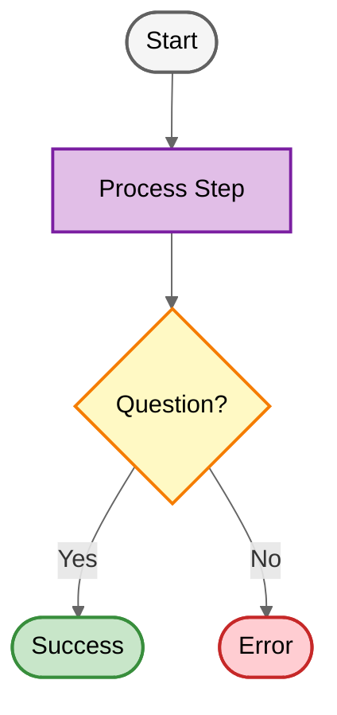

# Flowchart Template - Light Theme

This is a template for creating flowcharts with light theme styling.

## Usage

1. Copy the template above
2. Modify node definitions to match your workflow
3. Update connections between nodes
4. Adjust class applications (:::className) as needed
5. Keep text concise (under 60 characters per node)
