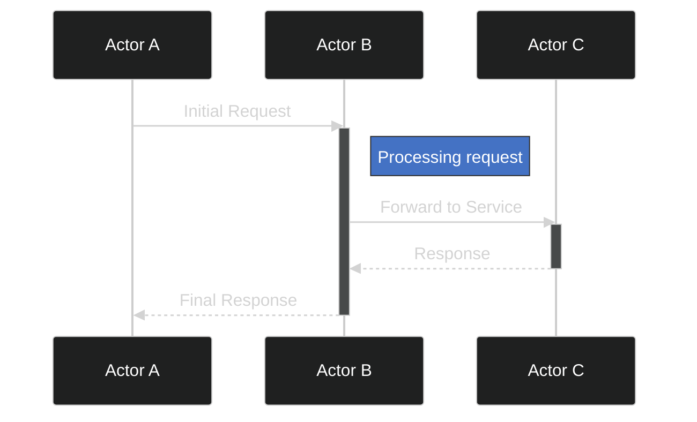

# Sequence Diagram Template

```mermaid
%%{init: {'theme':'dark', 'themeVariables': { 'primaryColor':'#1a1a1a', 'primaryTextColor':'#fff', 'primaryBorderColor':'#fff', 'lineColor':'#fff', 'actorTextColor':'#fff', 'noteBkgColor':'#4472C4', 'noteTextColor':'#fff'}}}%%

sequenceDiagram
    participant A as Actor A
    participant B as Actor B
    participant C as Actor C

    A->>B: Initial Request
    activate B
    Note right of B: Processing request
    B->>C: Forward to Service
    activate C
    C-->>B: Response
    deactivate C
    B-->>A: Final Response
    deactivate B
```
