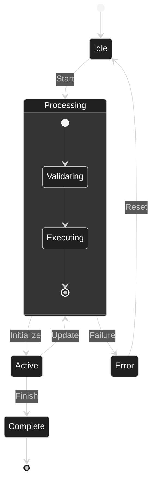

# State Diagram Template

```mermaid
%%{init: {'theme':'dark', 'themeVariables': { 'primaryColor':'#1a1a1a', 'primaryTextColor':'#fff', 'primaryBorderColor':'#fff', 'lineColor':'#fff'}}}%%

stateDiagram-v2
    [*] --> Idle
    Idle --> Processing: Start
    Processing --> Active: Initialize
    Active --> Processing: Update
    Active --> Complete: Finish
    Processing --> Error: Failure
    Error --> Idle: Reset
    Complete --> [*]

    state Processing {
        [*] --> Validating
        Validating --> Executing
        Executing --> [*]
    }
```
