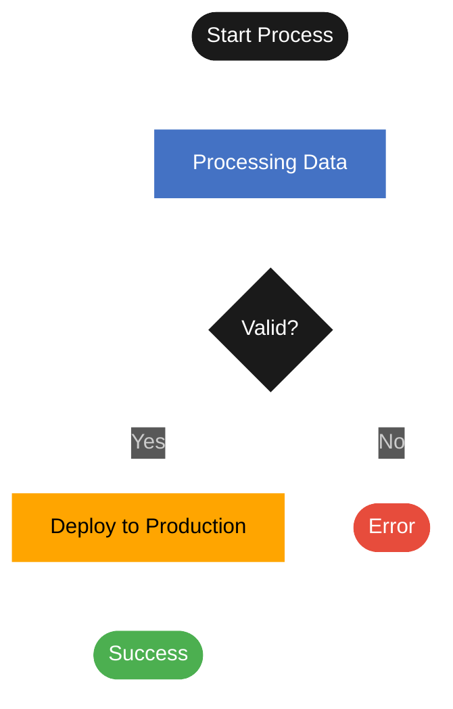
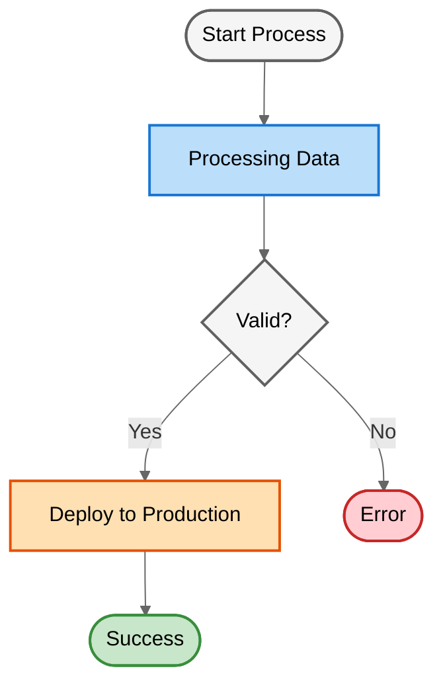

# Mermaid Diagram Color Theme Guide

This guide defines the approved color palette and styling patterns for creating consistent, professional Mermaid diagrams.

## Approved Color Palette

All Mermaid diagrams should use colors from this approved palette to ensure visual consistency and readability.

### Primary Colors

| Color Name | Hex Code | Usage |
|------------|----------|-------|
| Background | `#1a1a1a` | Dark background for diagrams |
| Text | `#ffffff` | Primary text color (white) |
| Text Alt | `#f5f5f5` | Alternative text color (off-white) |

### Accent Colors

| Color Name | Hex Code | Usage |
|------------|----------|-------|
| Blue | `#4472C4` | Status items, in-progress states, information |
| Blue Light | `#6B9BD1` | Secondary blue, hover states |
| Orange | `#FFA500` | Production, critical items, warnings |
| Orange Light | `#FFB732` | Secondary orange, less critical warnings |
| Green | `#4CAF50` | Completion states, success, approved items |
| Green Light | `#66BB6A` | Secondary green, positive secondary actions |
| Red | `#E74C3C` | Errors, failures, rejected items |
| Red Light | `#EC7063` | Secondary red, less critical errors |

### Supporting Colors

| Color Name | Hex Code | Usage |
|------------|----------|-------|
| Gray | `#6c757d` | Neutral items, disabled states |
| Gray Light | `#9ba3a8` | Secondary gray, subtle borders |
| Purple | `#9B59B6` | Alternative accent, special states |
| Teal | `#1abc9c` | Alternative accent, special categories |

## Theme Selection

Choose between dark and light themes based on the intended use case:

- **Dark Theme**: Best for documentation embedded in dark-mode interfaces, technical specs, or when requested
- **Light Theme**: Best for presentations, reports, printable documents, or when a softer, more accessible look is needed

## Styling Patterns

### 1. Dark Theme Configuration

Include this theme configuration at the top of your Mermaid diagram for dark themes:

```mermaid
%%{init: {'theme':'dark', 'themeVariables': { 'primaryColor':'#1a1a1a', 'primaryTextColor':'#fff', 'primaryBorderColor':'#fff', 'lineColor':'#fff', 'secondaryColor':'#4472C4', 'tertiaryColor':'#1a1a1a'}}}%%
```

### 1b. Light Theme Configuration

Include this theme configuration at the top of your Mermaid diagram for light themes:

```mermaid
%%{init: {'theme':'default', 'themeVariables': { 'primaryColor':'#E8EAF6', 'primaryTextColor':'#000', 'primaryBorderColor':'#7986CB', 'lineColor':'#666', 'secondaryColor':'#C5E1A5', 'tertiaryColor':'#FFE082'}}}%%
```

**Key differences for light themes:**
- Use `'theme':'default'` instead of `'theme':'dark'`
- Light pastel backgrounds with dark borders
- Black text (`#000`) for maximum readability
- Gray lines (`#666`) instead of white

### 2. Class Definitions for Reusable Styles

#### Dark Theme Class Definitions

Use `classDef` to create reusable style classes for dark themes:

```mermaid
classDef statusNode fill:#4472C4,stroke:#fff,stroke-width:2px,color:#fff
classDef productionNode fill:#FFA500,stroke:#fff,stroke-width:2px,color:#000
classDef successNode fill:#4CAF50,stroke:#fff,stroke-width:2px,color:#fff
classDef errorNode fill:#E74C3C,stroke:#fff,stroke-width:2px,color:#fff
classDef defaultNode fill:#1a1a1a,stroke:#fff,stroke-width:2px,color:#fff
classDef decisionNode fill:#1a1a1a,stroke:#fff,stroke-width:2px,color:#fff
```

#### Light Theme Class Definitions

Use these pastel colors for light themes:

```mermaid
classDef statusNode fill:#BBDEFB,stroke:#1976D2,stroke-width:2px,color:#000
classDef actionNode fill:#E1BEE7,stroke:#7B1FA2,stroke-width:2px,color:#000
classDef decisionNode fill:#FFF9C4,stroke:#F57C00,stroke-width:2px,color:#000
classDef successNode fill:#C8E6C9,stroke:#388E3C,stroke-width:2px,color:#000
classDef warningNode fill:#FFE0B2,stroke:#E65100,stroke-width:2px,color:#000
classDef errorNode fill:#FFCDD2,stroke:#C62828,stroke-width:2px,color:#000
classDef defaultNode fill:#F5F5F5,stroke:#616161,stroke-width:2px,color:#000
```

**Light Theme Palette:**
- Light Blue (`#BBDEFB`) - Status/information nodes
- Light Purple (`#E1BEE7`) - Action/process nodes
- Light Yellow (`#FFF9C4`) - Decision/choice nodes
- Light Green (`#C8E6C9`) - Success/completion nodes
- Light Orange (`#FFE0B2`) - Warning/attention nodes
- Light Red (`#FFCDD2`) - Error/failure nodes
- Light Gray (`#F5F5F5`) - Default/neutral nodes

### 3. Applying Styles to Nodes

Apply class definitions to specific nodes:

```mermaid
A[Node Text]:::defaultNode
B[Status Item]:::statusNode
C[Production Step]:::productionNode
D[Success]:::successNode
E[Error]:::errorNode
```

## Complete Examples

### Dark Theme Example

Here's a complete flowchart using the dark theme:



### Light Theme Example

Here's the same flowchart using the light theme:



## Text Readability Guidelines

### Font Sizing
- Keep node text concise (under 60 characters per line)
- Use line breaks for longer descriptions
- Consider using subgraphs for grouping related nodes

### Text Contrast
- White text (`#ffffff`) on dark backgrounds
- Black text (`#000000`) on light backgrounds (orange, yellow)
- Ensure minimum contrast ratio of 4.5:1 (WCAG AA standard)

### Text Formatting
```mermaid
A["<b>Bold Title</b><br/>Regular description"]
B["Line 1<br/>Line 2<br/>Line 3"]
C["Short & Clear"]
```

## Diagram Type Recommendations

### Flowcharts
- Use `flowchart TD` (top-down) or `flowchart LR` (left-right)
- Apply status colors to process nodes
- Use decision diamonds with default styling
- Apply success/error colors to terminal nodes

### Sequence Diagrams
- Use default dark theme
- Apply actor styling consistently
- Use note boxes with blue background for important callouts

### State Diagrams
- Use green for active/current states
- Use gray for inactive states
- Use orange for transition states

### Gantt Charts
- Use blue for in-progress tasks
- Use green for completed tasks
- Use orange for critical path items

## Validation Checklist

Before finalizing any Mermaid diagram:

- [ ] Uses approved color palette only
- [ ] Includes dark theme configuration
- [ ] Text is readable (high contrast, appropriate size)
- [ ] Node text is concise (under 60 chars)
- [ ] Uses classDef for repeated styling
- [ ] Renders without errors
- [ ] Follows diagram type conventions
- [ ] Consistent styling across similar node types

## Common Patterns

### Status-Based Coloring
```mermaid
A[Pending]:::defaultNode
B[In Progress]:::statusNode
C[Completed]:::successNode
D[Failed]:::errorNode
```

### Environment-Based Coloring
```mermaid
Dev[Development]:::statusNode
UAT[UAT Testing]:::statusNode
Prod[Production]:::productionNode
```

### Decision Trees
```mermaid
Decision{Question?}:::defaultNode
Decision -->|Yes| Success[Approved]:::successNode
Decision -->|No| Fail[Rejected]:::errorNode
```
